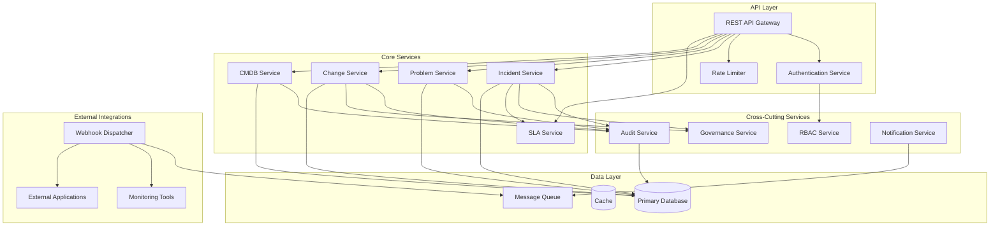
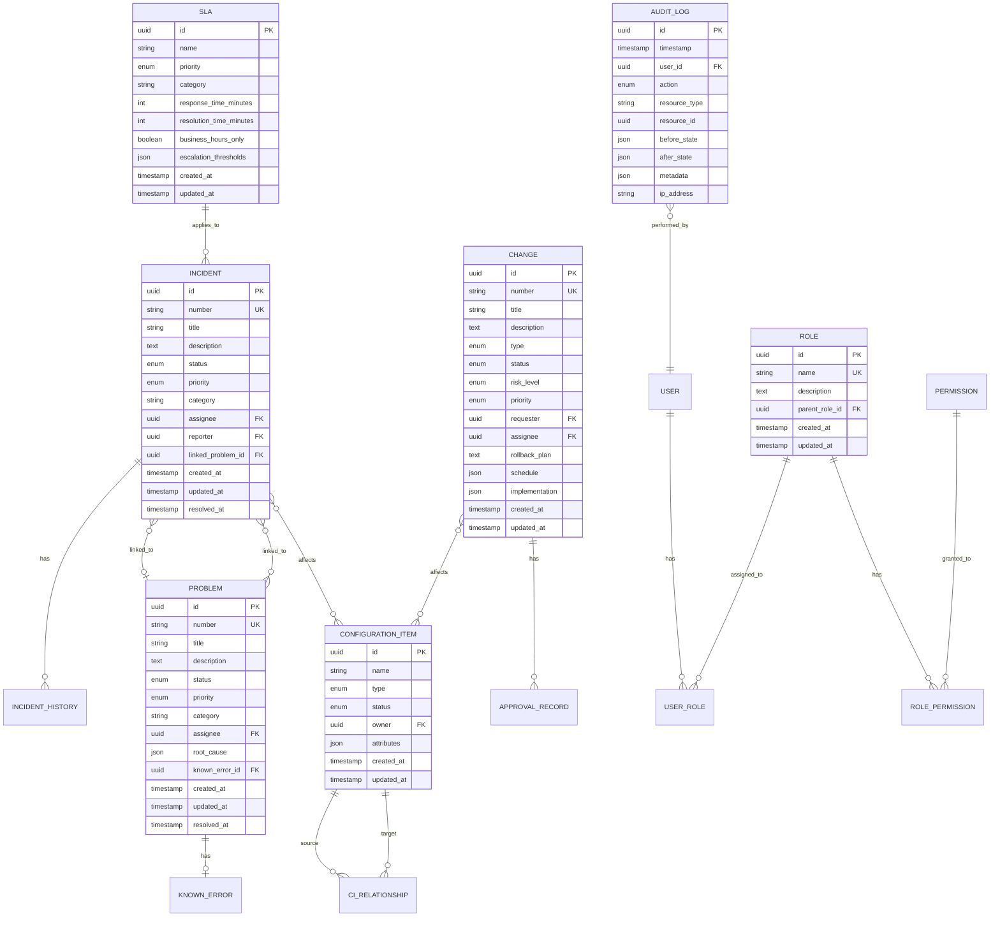

# Design Document

## Overview

The ITSM Platform is an API-first IT Service Management system built on ITIL best practices. It provides a modular, extensible architecture for managing incidents, problems, and changes while maintaining strict governance, compliance, and role-based access control.

The system is designed as a RESTful API backend that can integrate with any frontend application, monitoring tool, or external ticketing system. All operations are performed through well-defined API endpoints, enabling automation and seamless integration with existing IT infrastructure.

### Key Design Principles

- **API-First**: All functionality exposed through RESTful APIs with OpenAPI specification
- **Event-Driven**: State changes trigger events for webhooks and internal processing
- **Audit-Complete**: Every modification creates immutable audit records
- **ITIL-Aligned**: Workflows and processes follow ITIL v4 guidelines
- **Extensible**: Plugin architecture for custom workflows and integrations

## Architecture



### Technology Stack

- **Runtime**: Node.js with TypeScript
- **API Framework**: Express.js with OpenAPI validation
- **Database**: PostgreSQL for relational data
- **Cache**: Redis for session management and rate limiting
- **Message Queue**: Redis Pub/Sub for event distribution
- **Authentication**: JWT tokens with refresh token rotation
- **Testing**: Vitest for unit tests, fast-check for property-based testing

## Components and Interfaces

### 1. API Gateway

The API Gateway handles all incoming HTTP requests, performing authentication, rate limiting, and request validation.

```typescript
interface APIGateway {
  // Request handling
  handleRequest(request: HTTPRequest): Promise<HTTPResponse>;
  
  // Middleware chain
  authenticate(request: HTTPRequest): Promise<AuthContext>;
  rateLimit(request: HTTPRequest): Promise<boolean>;
  validateSchema(request: HTTPRequest, schema: OpenAPISchema): ValidationResult;
}

interface HTTPRequest {
  method: 'GET' | 'POST' | 'PUT' | 'PATCH' | 'DELETE';
  path: string;
  headers: Record<string, string>;
  body?: unknown;
  query?: Record<string, string>;
}

interface HTTPResponse {
  status: number;
  headers: Record<string, string>;
  body: unknown;
}

interface AuthContext {
  userId: string;
  roles: string[];
  permissions: string[];
  tokenExpiry: Date;
}
```

### 2. Incident Service

Manages the complete lifecycle of incidents from creation to resolution.

```typescript
interface IncidentService {
  create(data: CreateIncidentDTO, context: AuthContext): Promise<Incident>;
  getById(id: string, context: AuthContext): Promise<Incident | null>;
  update(id: string, data: UpdateIncidentDTO, context: AuthContext): Promise<Incident>;
  transition(id: string, newStatus: IncidentStatus, context: AuthContext): Promise<Incident>;
  linkToProblem(incidentId: string, problemId: string, context: AuthContext): Promise<void>;
  search(criteria: IncidentSearchCriteria, context: AuthContext): Promise<PaginatedResult<Incident>>;
}

interface Incident {
  id: string;
  number: string;
  title: string;
  description: string;
  status: IncidentStatus;
  priority: Priority;
  category: string;
  assignee?: string;
  reporter: string;
  affectedCIs: string[];
  linkedProblemId?: string;
  slaDeadlines: SLADeadlines;
  history: StatusTransition[];
  createdAt: Date;
  updatedAt: Date;
  resolvedAt?: Date;
}

type IncidentStatus = 'New' | 'InProgress' | 'Pending' | 'Resolved' | 'Closed';
type Priority = 'Critical' | 'High' | 'Medium' | 'Low';

interface StatusTransition {
  fromStatus: IncidentStatus | null;
  toStatus: IncidentStatus;
  timestamp: Date;
  userId: string;
  comment?: string;
}
```

### 3. Problem Service

Handles problem records, root cause analysis, and known error management.

```typescript
interface ProblemService {
  create(data: CreateProblemDTO, context: AuthContext): Promise<Problem>;
  getById(id: string, context: AuthContext): Promise<Problem | null>;
  update(id: string, data: UpdateProblemDTO, context: AuthContext): Promise<Problem>;
  recordRootCause(id: string, rootCause: RootCauseAnalysis, context: AuthContext): Promise<Problem>;
  createKnownError(problemId: string, knownError: KnownErrorDTO, context: AuthContext): Promise<KnownError>;
  resolve(id: string, resolution: ResolutionDTO, context: AuthContext): Promise<Problem>;
  getLinkedIncidents(id: string, context: AuthContext): Promise<Incident[]>;
}

interface Problem {
  id: string;
  number: string;
  title: string;
  description: string;
  status: ProblemStatus;
  priority: Priority;
  category: string;
  linkedIncidentIds: string[];
  rootCause?: RootCauseAnalysis;
  knownErrorId?: string;
  assignee?: string;
  createdAt: Date;
  updatedAt: Date;
  resolvedAt?: Date;
}

interface RootCauseAnalysis {
  causeCategory: string;
  description: string;
  analyzedBy: string;
  analyzedAt: Date;
}

interface KnownError {
  id: string;
  problemId: string;
  title: string;
  description: string;
  workaround: string;
  permanentFix?: string;
  createdAt: Date;
}

type ProblemStatus = 'New' | 'UnderInvestigation' | 'KnownError' | 'Resolved' | 'Closed';
```

### 4. Change Service

Manages change requests through their approval and implementation lifecycle.

```typescript
interface ChangeService {
  create(data: CreateChangeDTO, context: AuthContext): Promise<Change>;
  getById(id: string, context: AuthContext): Promise<Change | null>;
  update(id: string, data: UpdateChangeDTO, context: AuthContext): Promise<Change>;
  submitForApproval(id: string, context: AuthContext): Promise<Change>;
  approve(id: string, decision: ApprovalDecision, context: AuthContext): Promise<Change>;
  schedule(id: string, schedule: ChangeSchedule, context: AuthContext): Promise<Change>;
  recordImplementation(id: string, result: ImplementationResult, context: AuthContext): Promise<Change>;
  checkScheduleConflicts(schedule: ChangeSchedule): Promise<Change[]>;
}

interface Change {
  id: string;
  number: string;
  title: string;
  description: string;
  type: ChangeType;
  status: ChangeStatus;
  riskLevel: RiskLevel;
  priority: Priority;
  requester: string;
  assignee?: string;
  affectedCIs: string[];
  approvals: ApprovalRecord[];
  schedule?: ChangeSchedule;
  implementation?: ImplementationResult;
  rollbackPlan: string;
  createdAt: Date;
  updatedAt: Date;
}

type ChangeType = 'Standard' | 'Normal' | 'Emergency';
type ChangeStatus = 'Draft' | 'Submitted' | 'Approved' | 'Rejected' | 'Scheduled' | 'InProgress' | 'Completed' | 'Failed' | 'Cancelled';
type RiskLevel = 'Low' | 'Medium' | 'High' | 'Critical';

interface ApprovalRecord {
  approverId: string;
  decision: 'Approved' | 'Rejected';
  timestamp: Date;
  comments?: string;
}

interface ChangeSchedule {
  plannedStart: Date;
  plannedEnd: Date;
  changeWindow?: string;
}

interface ImplementationResult {
  actualStart: Date;
  actualEnd: Date;
  outcome: 'Successful' | 'Failed' | 'PartialSuccess';
  notes?: string;
  rollbackPerformed: boolean;
}
```

### 5. CMDB Service

Manages configuration items and their relationships.

```typescript
interface CMDBService {
  createCI(data: CreateCIDTO, context: AuthContext): Promise<ConfigurationItem>;
  getCI(id: string, context: AuthContext): Promise<ConfigurationItem | null>;
  updateCI(id: string, data: UpdateCIDTO, context: AuthContext): Promise<ConfigurationItem>;
  createRelationship(relationship: CIRelationshipDTO, context: AuthContext): Promise<CIRelationship>;
  getRelationships(ciId: string, context: AuthContext): Promise<CIRelationship[]>;
  analyzeImpact(ciId: string, context: AuthContext): Promise<ImpactAnalysisResult>;
  updateStatus(id: string, status: CIStatus, context: AuthContext): Promise<ConfigurationItem>;
}

interface ConfigurationItem {
  id: string;
  name: string;
  type: CIType;
  status: CIStatus;
  owner: string;
  attributes: Record<string, unknown>;
  createdAt: Date;
  updatedAt: Date;
}

type CIType = 'Server' | 'Application' | 'Database' | 'Network' | 'Service' | 'Other';
type CIStatus = 'Active' | 'Inactive' | 'Maintenance' | 'Retired';

interface CIRelationship {
  id: string;
  sourceCIId: string;
  targetCIId: string;
  relationshipType: RelationshipType;
  createdAt: Date;
}

type RelationshipType = 'DependsOn' | 'Contains' | 'ConnectsTo' | 'RunsOn' | 'UsedBy';

interface ImpactAnalysisResult {
  rootCI: ConfigurationItem;
  affectedCIs: ConfigurationItem[];
  relationshipPaths: RelationshipPath[];
}
```

### 6. RBAC Service

Handles role-based access control with hierarchical permissions.

```typescript
interface RBACService {
  assignRole(userId: string, roleId: string, context: AuthContext): Promise<void>;
  removeRole(userId: string, roleId: string, context: AuthContext): Promise<void>;
  getUserPermissions(userId: string): Promise<Permission[]>;
  checkPermission(userId: string, permission: string, resource?: string): Promise<boolean>;
  createRole(role: CreateRoleDTO, context: AuthContext): Promise<Role>;
  updateRole(roleId: string, data: UpdateRoleDTO, context: AuthContext): Promise<Role>;
}

interface Role {
  id: string;
  name: string;
  description: string;
  permissions: Permission[];
  parentRoleId?: string;
  createdAt: Date;
  updatedAt: Date;
}

interface Permission {
  id: string;
  name: string;
  resource: string;
  actions: PermissionAction[];
}

type PermissionAction = 'create' | 'read' | 'update' | 'delete' | 'approve' | 'assign';

interface UserRole {
  userId: string;
  roleId: string;
  assignedAt: Date;
  assignedBy: string;
}
```

### 7. Audit Service

Creates and manages immutable audit logs.

```typescript
interface AuditService {
  log(entry: AuditEntry): Promise<void>;
  search(criteria: AuditSearchCriteria, context: AuthContext): Promise<PaginatedResult<AuditLog>>;
  getByRecordId(recordType: string, recordId: string, context: AuthContext): Promise<AuditLog[]>;
}

interface AuditEntry {
  userId: string;
  action: AuditAction;
  resourceType: string;
  resourceId: string;
  beforeState?: unknown;
  afterState?: unknown;
  metadata?: Record<string, unknown>;
}

interface AuditLog {
  id: string;
  timestamp: Date;
  userId: string;
  action: AuditAction;
  resourceType: string;
  resourceId: string;
  beforeState?: unknown;
  afterState?: unknown;
  metadata?: Record<string, unknown>;
  ipAddress?: string;
}

type AuditAction = 'Create' | 'Update' | 'Delete' | 'StatusChange' | 'Approve' | 'Reject' | 'Assign' | 'AccessDenied';
```

### 8. SLA Service

Manages SLA definitions and tracks compliance.

```typescript
interface SLAService {
  defineSLA(sla: CreateSLADTO, context: AuthContext): Promise<SLA>;
  calculateDeadlines(incident: Incident): Promise<SLADeadlines>;
  checkBreaches(): Promise<SLABreach[]>;
  getMetrics(criteria: SLAMetricsCriteria, context: AuthContext): Promise<SLAMetrics>;
  triggerEscalation(incidentId: string, escalationType: EscalationType): Promise<void>;
}

interface SLA {
  id: string;
  name: string;
  priority: Priority;
  category?: string;
  responseTimeMinutes: number;
  resolutionTimeMinutes: number;
  businessHoursOnly: boolean;
  escalationThresholds: EscalationThreshold[];
  createdAt: Date;
  updatedAt: Date;
}

interface SLADeadlines {
  responseDeadline: Date;
  resolutionDeadline: Date;
  slaId: string;
  breached: boolean;
  breachedAt?: Date;
}

interface EscalationThreshold {
  percentageRemaining: number;
  notifyRoles: string[];
}

interface SLAMetrics {
  totalTickets: number;
  breachedCount: number;
  compliancePercentage: number;
  averageResponseTime: number;
  averageResolutionTime: number;
  byPriority: Record<Priority, SLAMetricsSummary>;
  byCategory: Record<string, SLAMetricsSummary>;
}
```

### 9. Governance Service

Enforces governance policies and compliance rules.

```typescript
interface GovernanceService {
  definePolicy(policy: CreatePolicyDTO, context: AuthContext): Promise<GovernancePolicy>;
  validateAction(action: GovernanceAction): Promise<PolicyValidationResult>;
  getViolations(criteria: ViolationCriteria, context: AuthContext): Promise<PolicyViolation[]>;
  generateComplianceReport(criteria: ReportCriteria, context: AuthContext): Promise<ComplianceReport>;
}

interface GovernancePolicy {
  id: string;
  name: string;
  description: string;
  resourceType: string;
  rules: PolicyRule[];
  enabled: boolean;
  createdAt: Date;
  updatedAt: Date;
}

interface PolicyRule {
  field: string;
  condition: 'required' | 'equals' | 'notEquals' | 'in' | 'notIn' | 'matches';
  value: unknown;
  message: string;
}

interface PolicyValidationResult {
  valid: boolean;
  violations: PolicyViolation[];
}

interface PolicyViolation {
  policyId: string;
  policyName: string;
  rule: PolicyRule;
  actualValue: unknown;
  timestamp: Date;
}
```

## Data Models

### Database Schema




## Correctness Properties

*A property is a characteristic or behavior that should hold true across all valid executions of a system-essentially, a formal statement about what the system should do. Properties serve as the bridge between human-readable specifications and machine-verifiable correctness guarantees.*

### Property 1: Incident Creation Invariants
*For any* valid incident submission, the created incident SHALL have a unique identifier, a timestamp equal to or after the submission time, and status "New".
**Validates: Requirements 1.1**

### Property 2: Required Field Validation
*For any* incident creation request missing title, description, priority, or category, the system SHALL reject the request with a validation error.
**Validates: Requirements 1.2**

### Property 3: Priority Value Validation
*For any* priority value not in the set {Critical, High, Medium, Low}, the system SHALL reject the incident creation or update request.
**Validates: Requirements 1.3**

### Property 4: Status Transition History
*For any* incident status change, the incident history SHALL contain a new entry with the transition details, timestamp, and user information.
**Validates: Requirements 1.4**

### Property 5: Bidirectional Incident-Problem Linking
*For any* incident linked to a problem, both the incident's linkedProblemId and the problem's linkedIncidentIds SHALL reference each other.
**Validates: Requirements 1.5, 2.1**

### Property 6: Incident Search Filter Correctness
*For any* incident search with filters, all returned incidents SHALL match all specified filter criteria (status, priority, assignee, category, date range).
**Validates: Requirements 1.6**

### Property 7: Problem Resolution Cascades to Incidents
*For any* problem that is resolved, all linked incidents SHALL be updated with the resolution information.
**Validates: Requirements 2.4**

### Property 8: Problem Query Metrics Accuracy
*For any* problem query, the returned incident count SHALL equal the actual number of linked incidents.
**Validates: Requirements 2.5**

### Property 9: Change Type Validation
*For any* change request, the type SHALL be one of {Standard, Normal, Emergency}.
**Validates: Requirements 3.1**

### Property 10: Approval Record Completeness
*For any* approval decision on a change, the approval record SHALL contain timestamp, approver identity, and decision.
**Validates: Requirements 3.3**

### Property 11: Change Schedule Conflict Detection
*For any* change schedule that overlaps with existing scheduled changes, the system SHALL detect and report the conflict.
**Validates: Requirements 3.4**

### Property 12: Failed Change Creates Incident
*For any* change implementation marked as failed, the system SHALL create a corresponding incident record.
**Validates: Requirements 3.6**

### Property 13: Authentication Token Expiry
*For any* successful authentication, the returned token SHALL have an expiry time in the future.
**Validates: Requirements 4.1**

### Property 14: Rate Limit Response Format
*For any* request that exceeds rate limits, the response SHALL be HTTP 429 with a retry-after header.
**Validates: Requirements 4.5**

### Property 15: Role Permission Grant
*For any* user assigned a role, the user's effective permissions SHALL include all permissions associated with that role.
**Validates: Requirements 5.1**

### Property 16: Permission Hierarchy Inheritance
*For any* role with a parent role, the child role's effective permissions SHALL include all parent role permissions.
**Validates: Requirements 5.3**

### Property 17: Unauthorized Access Denial and Logging
*For any* action attempted without required permissions, the system SHALL deny the request and create an audit log entry with action "AccessDenied".
**Validates: Requirements 5.2, 5.5**

### Property 18: Audit Log Immutability and Completeness
*For any* data modification, an audit log entry SHALL be created with timestamp, user, action, and before/after state values.
**Validates: Requirements 6.1**

### Property 19: Audit Log Search Filter Correctness
*For any* audit log search with filters, all returned entries SHALL match all specified filter criteria.
**Validates: Requirements 6.3**

### Property 20: CI Relationship Bidirectionality
*For any* CI relationship created, navigation from source to target and target to source SHALL both succeed.
**Validates: Requirements 7.2**

### Property 21: Impact Analysis Completeness
*For any* CI with dependencies, impact analysis SHALL return all directly and transitively dependent CIs.
**Validates: Requirements 7.4**

### Property 22: SLA Deadline Calculation
*For any* incident created with a matching SLA rule, the SLA deadlines SHALL be calculated based on the SLA's response and resolution time targets.
**Validates: Requirements 8.2**

### Property 23: SLA Breach Recording
*For any* incident that exceeds its SLA deadline, the incident SHALL be marked as breached with the breach timestamp.
**Validates: Requirements 8.4**

### Property 24: JSON Serialization Round-Trip
*For any* domain object, serializing to JSON and deserializing back SHALL produce an equivalent object.
**Validates: Requirements 9.3**

### Property 25: Date Serialization Format
*For any* date/time value serialized to JSON, the output SHALL be in ISO 8601 format with timezone information.
**Validates: Requirements 9.5**

## Error Handling

### API Error Response Structure

All API errors follow a consistent JSON structure:

```typescript
interface APIError {
  error: {
    code: string;
    message: string;
    details?: Record<string, unknown>;
    timestamp: string;
    requestId: string;
  };
}
```

### Error Categories

| HTTP Status | Error Code | Description |
|-------------|------------|-------------|
| 400 | VALIDATION_ERROR | Request validation failed |
| 401 | AUTHENTICATION_REQUIRED | Missing or invalid authentication |
| 403 | PERMISSION_DENIED | User lacks required permission |
| 404 | RESOURCE_NOT_FOUND | Requested resource does not exist |
| 409 | CONFLICT | Resource state conflict (e.g., schedule overlap) |
| 422 | BUSINESS_RULE_VIOLATION | Governance policy or business rule violated |
| 429 | RATE_LIMIT_EXCEEDED | Too many requests |
| 500 | INTERNAL_ERROR | Unexpected server error |

### Validation Error Details

Validation errors include field-level details:

```typescript
interface ValidationErrorDetails {
  fields: {
    field: string;
    message: string;
    value?: unknown;
  }[];
}
```

## Testing Strategy

### Unit Testing

- **Framework**: Vitest
- **Coverage Target**: 80% line coverage for core services
- **Focus Areas**:
  - Service method logic
  - Validation functions
  - Data transformation utilities
  - Error handling paths

### Property-Based Testing

- **Framework**: fast-check
- **Minimum Iterations**: 100 per property
- **Tag Format**: `**Feature: itsm-platform, Property {number}: {property_text}**`

Property-based tests will validate the correctness properties defined above, generating random inputs to verify that properties hold across all valid input combinations.

### Integration Testing

- **Database**: Test containers with PostgreSQL
- **API Testing**: Supertest for HTTP endpoint testing
- **Focus Areas**:
  - End-to-end API workflows
  - Database transaction integrity
  - Cross-service interactions

### Test Organization

```
src/
├── services/
│   ├── incident/
│   │   ├── incident.service.ts
│   │   ├── incident.service.test.ts      # Unit tests
│   │   └── incident.service.property.test.ts  # Property tests
│   ├── problem/
│   ├── change/
│   └── ...
└── tests/
    └── integration/
        ├── incident.integration.test.ts
        └── ...
```
